class: inverse, bottom, right

```{r setup, include=FALSE, cache = FALSE}
require("knitr")
options(htmltools.dir.version = FALSE)
pacman::p_load(RefManageR)
```

```{r eval=FALSE, echo=FALSE}
# Correr esta linea para ejecutar
rmarkdown::render('xaringan::moon_reader')
```

<!---
About macros.js: permite escalar las imágenes como [:scale 50%](path to image), hay si que grabar ese archivo js en el directorio.
.pull-left[<images/Conocimiento cívico.png>] 
.pull-right[<images/Conocimiento cívico_graf.png>]

--->

### ¿Qué pueden hacer las escuelas para promover actitudes positivas hacia la igualdad de derechos? 
### Las buenas relaciones entre profesores y estudiantes como una oportunidad para disminuir las diferencias en estas actitudes
<br>
<br>
<hr>

<br>

#### Anais Herrera Leighton

*Examen de grado para optar al título de Socióloga y Magíster en Ciencias Sociales, Universidad de Chile*

---

layout: true
class: animated, fadeIn

---
class: inverse, middle, center

# <strong><span style='color:#FFFFFF'> Introducción </span></strong>
---

## Igualdad de derechos: problemáticas y horizontes
* <p style="text-align: justify;"> Democracias latinoamericanas y caribeñas aún no garantizan que toda la población goce de los DDHH (Bárcena, Prado, Abramo & Pérez, 2016) </p>


* <p style="text-align: justify;"> ¿Cómo fomentar políticas públicas que avancen a garantizar la igualdad? </p> 


* <p style="text-align: justify;"> El rol de la educación (UNESCO, s.f.) </p>

.center[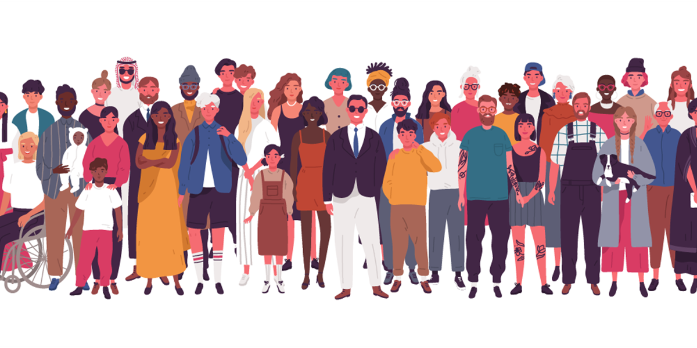]

???

La igualdad de derechos es uno de los principios fundamentales de todo sistema democrático, teniendo un rol central en el desarrollo sostenible de los países. Sin embargo, las democracias latinoamericanas y caribeñas aún no son capaces de garantizar que toda la población goce efectivamente de los derechos consagrados en la Declaración Universal de Derechos Humanos. 

Frente a este panorama cabe preguntarse ¿cómo se puede fomentar políticas públicas que avancen a garantizar la igualdad de derechos? En países democráticos, como Chile, la promoción de leyes que avancen en este sentido dependerá, en buena medida, del apoyo de la ciudadanía hacia la igualdad de derechos.

Y por lo tanto para promover actitudes positivas hacia la igualdad de derechos entre la ciudadanía, la educación se vuelve fundamental ya que puede contribuir a formar actitudes vitalicias. Siendo la socialización escolar en particular un espacio estratégico en el cual el Estado puede intervenir para fomentar principios valóricos de la democracia, como el respeto y la igualdad.

---

## Socialización de las actitudes hacia la igualdad de derechos

.pull-left[
Igualdad de derechos:
* <p style="text-align: justify;"> <i>“Todos los seres humanos nacen libres e iguales en dignidad y derechos y, dotados como están de razón y conciencia, deben comportarse fraternalmente los unos con los otros.”</i> (Artículo 1). </p>]

.pull-right[
Formación ciudadana:
* <p style="text-align: justify;"> <i>“Proceso formativo continuo que permite que los niños, niñas, jóvenes y adultos desarrollen un conjunto de conocimientos, habilidades y actitudes que resultan fundamentales para la vida en una sociedad democrática.” </i>(Mineduc, 2016, p.11)   </p>]

Actitudes:
* <p style="text-align: justify;"> Juicios o evaluaciones respecto a ideas, objetos, personas, situaciones y/o relaciones (Schulz, Ainley, Fraillon, Losito & Agrusti, 2016) </p>

???

De modo que se vuelve fundamental analizar los factores que inciden en el proceso de socialización política de dichas actitudes. Asimismo, enfocar este análisis en jóvenes en edad escolar puede permitirnos comprender por qué se generan diferencias en las predisposiciones a la igualdad de derechos e identificar las prácticas y/o condiciones de la escuela que favorecen una actitud positiva hacia la igualdad de derechos. 

A modo de breve precisión conceptual, cabe precisar que la igualdad de derechos será entendida siguiendo los lineamientos de la Declaración Universal de Derechos Humanos de 1948, según la cual, en su artículo 1, define que CITA. 

Asimismo, en el contexto de la formación ciudadana, entendida como un proceso formativo que permite que las personas desarrollen conocimientos, habilidades y actitudes fundamentales para la vida en sociedad, en este trabajo se entienden las actitudes como uno de los ámbitos de la formación ciudadana. Y más precisamente, en el marco de los estudios sobre educación cívica, entenderemos las actitudes como los CITA

En consecuencia, se ha realizado una revisión bibliográfica de los estudios que indagan en los factores que inciden en el proceso de socialización de actitudes positivas hacia la igualdad de derechos en jóvenes en edad escolar.

---

## Características del estudiante

* <p style="text-align: justify;"> Modelo de recursos (Schlozman, Verba & Brady, 2012). </p>

    + <p style="text-align: justify;"> Recursos socioeconómicos (Miranda, Castillo & Cumsille, 2018). </p>

* <p style="text-align: justify;"> Posición de desventaja y demandas (Miranda et al, 2018). </p>

    + <p style="text-align: justify;">Antecedentes migratorios (Miranda et al, 2018). </p>

    + <p style="text-align: justify;">Sexo (Miranda et al, 2018; Schulz, Ainley, Cox & Friedman, 2018). </p>

* <p style="text-align: justify;">Conocimiento cívico (Schulz, Ainley, Cox et al, 2016; Schulz et al, 2011). </p>

.center[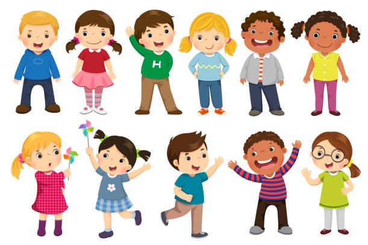]

???

Y en esta búsqueda bibliográfica, he encontrado dos líneas de investigación. Una se ha centrado en las características del estudiante. 

Dentro de esta línea de estudio, se encuentra la teoría del modelo de recursos, según la cual las personas que tienen más recursos (como dinero, tiempo o conocimientos) tienen ventajas para el ejercicio de la ciudadanía. Esta teoría ha sido aplicada en el trabajo de Miranda, Castillo y Cumsille, quienes generan evidencia de la asociación positiva entre los recursos de la familia del estudiante y las actitudes hacia la igualdad de derechos 

Asimismo, una línea de estudios de psicología social, propone que las personas que se encuentran en una posición de desventaja demandan más igualdad. En esta línea se ha evidenciado que poseer antecedentes migratorios y pertenecer al sexo femenino se asocian positivamente con las actitudes hacia la igualdad de derechos. 

Por último, también se ha evidenciado en distintos estudios que el nivel de conocimiento cívico se asocia de forma positiva con las actitudes hacia la igualdad de derechos.

---

## Características y prácticas de la escuela 

* <p style="text-align: justify;"> Efecto de los compañeros (Bellei, 2013) y  teoría del contacto intergrupal (Allport, 1954) </p>

    + <p style="text-align: justify;"> Inmigrantes (Isac, Maslowski & Van der Werf, 2012). </p>

    + <p style="text-align: justify;"> Composición étnica (Sincer, Volman, Veen & Severiens, 2020). </p>
    
* <p style="text-align: justify;"> Apertura a la discusión (Barber, Torney-Purta & Fennelly, 2010). </p>

* <p style="text-align: justify;"> Clima escolar (Caro & Schulz 2012). </p>


.center[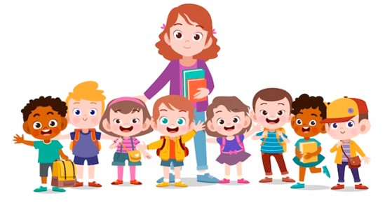]

???

Por otro lado, una segunda línea de estudios se ha centrado en características y prácticas de la comunidad escolar.

En primer lugar, se ha propuesto que la composición de los estudiantes que comparten un aula afecta los resultados educativos, así como también se ha propuesto que el contacto entre personas de distintos grupos contribuye a reducir la hostilidad intergrupal. Este efecto de composición del aula se ha evidenciado en la relación positiva entre la identidad migrante y las actitudes hacia la igualdad de derechos, así como también se ha estudiado que la diversidad en la composición étnica del aula mejora las competencias de los estudiantes para lidear con las diferencias.

En segundo lugar, se ha propuesto que la apertura a la discusión en el aula genera un ambiente favorable para
el desarrollo de actitudes más tolerantes y respetuosas hacia los demás, asociándose positivamente con las actitudes hacia la igualdad de derechos.

Por último, otro eje de análisis relevante en relación a los procesos de socialización refiere al clima escolar. En este sentido se han generado evidencias sobre la asociación positiva entre las actitudes hacia la igualdad de derechos y el clima escolar.

---

class: inverse, middle, center

# <strong><span style='color:#FFFFFF'> ¿En qué medida características y prácticas de la escuela afectan la relación entre las actitudes hacia la igualdad de derechos de estudiantes en Chile y sus características individuales? </span></strong>

???

Teniendo en consideración que existen diferencias individuales en las actitudes hacia la igualdad de derechos de los jóvenes, considero que es necesario indagar en cómo podemos terminar con estas diferencias, o al menos disminuirlas.

Es en este sentido que me gustaría aportar a las dos líneas de estudio enunciadas, incorporando ambas teorías en un modelo estadístico que evalúe si la relación entre las actitudes hacia la igualdad de derechos y las características de cada estudiante puede ser moderada por alguno de los factores del proceso de socialización en la escuela sobre los cuales ya se tiene evidencia de su efecto en las actitudes hacia la igualdad de derechos.

[TOMA AGUA]

Buscando así contribuir a responder la pregunta de investigación "¿En qué medida características y prácticas de la escuela afectan la relación entre las actitudes hacia la igualdad de derechos de estudiantes en Chile y sus características individuales?"

---
## Módelo teórico 1: Hipótesis nivel individual
.center[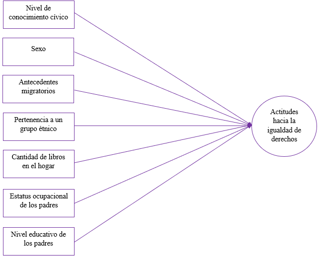]

???

En el diagrama se presenta el primer modelo teórico a ser testeado, el cual refiere a distintas hipótesis de las relaciones a nivel individual.

Más específicamente, se propone que existe una asociación positiva entre las actitudes hacia la igualdad de derechos y el nivel de conocimiento cívico del estudiante. 

Asimismo, se hipotetiza que pertenecer al sexo femenino, tener antecedentes migratorios y/o pertenecer a un grupo étnico se asociarán positivamente con las actitudes hacia la igualdad de derechos. 

Por último, se propone que existe una asociación positiva entre las actitudes hacia la igualdad de derechos y los recursos socioeconómicos de la familia del estudiante (más precisamente, la cantidad de libros en el hogar, el estatus ocupacional de los padres y el nivel educativo de los mismos).

---
## Módelo teórico 2: Hipótesis nivel escuela
.center[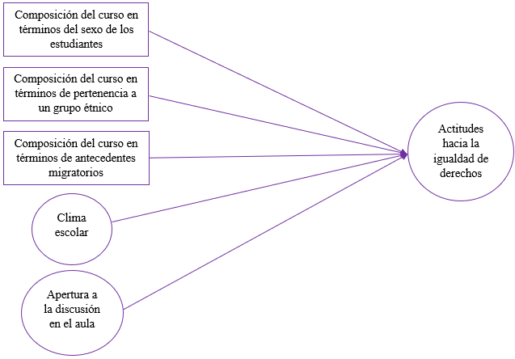]
  
???

En este diagrama se presenta ya el segundo modelo teórico a ser testeado, que refiere a las hipótesis de las relaciones sobre las variables independientes de nivel dos.

Se hipotetiza que las actitudes hacia la igualdad de derechos se relacionan positivamente con la diversidad en la composición del aula en términos de sexo, antecedentes migratorios y pertenencia a grupos étnicos, así como también se propone que tanto el clima escolar como la apertura a la discusión en el aula se asocian positivamente a las actitudes hacia la igualdad de derechos.

---
## Módelo teórico 3: Hipótesis general
<br>
<br>
.center[]

???

Este es el tercer y último modelo teórico a testear, y se relaciona con la hipótesis general del estudio y más relevante, la cual es de caracter principalmente exploratorio. 

Hipotetizo que alguna o algunas de las características y prácticas del contexto escolar tendrá la capacidad de disminuir el efecto de las características del estudiante sobre sus actitudes hacia la igualdad de derechos. 

Por poner un ejemplo de esta hipótesis de interacción, me refiero a que la apertura a la discusión en el aula disminuirá el efecto del nivel educacional de los padres en las actitudes hacia la igualdad de derechos.


---
class: inverse, middle, center

# <strong><span style='color:#FFFFFF'> Estrategia Metodológica </span></strong>

---
## Datos

* <p style="text-align: justify;">Estudio Internacional sobre Educación Cívica y Ciudadana (ICCS) 2016.</p>

* <p style="text-align: justify;">Datos de Chile: </p>

    + <p style="text-align: justify;"> General: 5.081 estudiantes de 8°básico de 178 escuelas. </p>

    + <p style="text-align: justify;"> Estudio: 3.920 estudiantes de 8°básico de 166 escuelas. </p>

???

En esta investigación utilicé los datos del Estudio Internacional sobre Educación Cívica y Ciudadana (ICCS) del año 2016.

Más precisamente, trabaje sobre los datos de Chile. Los cuales corresponden a una muestra representativa de los establecimientos, en la cual se incorporan todas las regiones, dependencias administrativas y zonas geográficas del país.

En este estudio trabaje con los datos de 3.920 estudiantes de 8°básico de 166 escuelas, los cuales corresponden a los datos donde no hay casos perdidos en ninguna de las variables de interés.

---
## Variables dependientes
.center[]

???

En la tabla se presentan los estadísticos descriptivos de las tres variables dependientes del estudio. Siguiendo el modelo de medición propuesto por Miranda y Castillo, se estimó un análisis factorial confirmatorio donde se propone que las actitudes hacia la igualdad de derechos se diferencian en tres dimensiones que se encuentran relacionadas entre sí: las actitudes hacia la igualdad de derechos entre hombres y mujeres, las actitudes hacia la igualdad de derechos para grupos étnicos. El modelo ajusto adecuadamente y se estimaron puntuaciones factoriales para las variables dependientes.

---
## Variables independientes: nivel individual
.center[]

---
## Variables independientes: nivel escuela
.center[]

---
## Método
* <p style="text-align: justify;"> Modelos de regresión multinivel. </p>

* <p style="text-align: justify;"> Se evaluaron las <strong> pendientes aleatorias </strong> para estimar <strong> efectos de interacción. </strong> </p>

* <p style="text-align: justify;"> Antes de los modelos multinivel se estimaron <strong> análisis factoriales confirmatorios </strong>. </p>

???

El principal método de análisis corresponde a la estimación de modelos de regresión multinivel. Estimé modelos de regresión multinivel para cada variable dependiente, utilizando el mismo grupo de variables independientes en todos los modelos.

Para poder evaluar posteriormente los efectos de interacción, primero se evaluaron los modelos multinivel aleatorizando las pendientes del efecto de las variables correspondientes a características individuales.

Cabe precisar que antes de estimar los modelos multinivel, se estimaron análisis factoriales confirmatorios para las variables latentes (que son tres, las actitudes hacia la igualdad de derechos, la apertura a la discusión y el clima escolar). Debido a que los resultados indicaban ajustes adecuados de los modelos de medida, se estimaron puntuaciones factoriales para estas variables. </p>

[NO LEER]
En relación al método de análisis, debido a que la regresión por mínimos cuadrados ordinarios tiene como supuesto la independencia entre los casos, decidí utilizar como técnica de análisis la estimación de modelos de regresión multinivel. Siguiendo los lineamientos del modelo de medición propuesto por Miranda, Castillo y Cumsille (2018), diferencié las actitudes hacia la igualdad de derechos en tres dimensiones: las Actitudes hacia la igualdad de derechos entre hombres y mujeres, las Actitudes hacia la igualdad de derechos para todos los grupos étnicos, y las Actitudes hacia la igualdad de derechos para homosexuales. Por lo que estimé tres modelos de regresión multinivel, uno para cada variable dependiente, utilizando el mismo grupo de variables independientes en todos los modelos.

Se evaluaron las pendientes aleatorias de un grupo de variables (aquellas descritas entre las características de los estudiantes) para posteriormente estimar efectos de interacción.

Cabe precisar que antes de análizar, o si quiera estimar los modelos multinivel, se estimaron análisis factoriales confirmatorios con el objetivo de evaluar si la dimensionalidad propuesta para medir las variables latentes presenta un ajuste adecuado. En el estudio las variables latentes corresponden a la variable dependiente actitudes hacia la igualdad de derechos que se diferenció en tres dimensiones, y a las variables independientes apertura a la discusión en el aula y el clima escolar. Este último, el clima escolar, también se diferenció en tres dimensiones generando tres variables. 

Los resultados de estos análisis factoriales confirmatorios indicaron que, si bien los modelos de medición no tienen un ajuste perfecto y presentan algunos indicios de un mal ajuste, en general a partir de la mayoría de los estadísticos evaluados es posible afirmar que los modelos tienen un ajuste adecuado, por lo que a partir de estos modelos se crearon parte de las variables a utilizar en los análisis estimando puntuaciones factoriales.

---
class: inverse, middle, center

# <strong><span style='color:#FFFFFF'> Resultados </span></strong>

---

.center[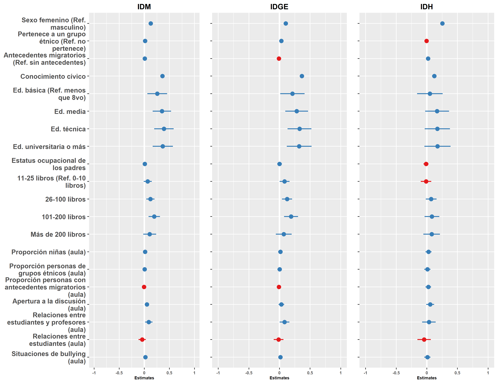]

???

En el gráfico se presentan los resultados de los modelos multinivel. Más precisamente, se presentan los coeficientes beta estandarizados junto con su intervalo de confianza. En cada modelo la línea blanca marca el 0, por lo que aquellas variables que se superponen con esta línea no tienen un efecto significativo en esa variable dependiente. En la medida en que el punto se aleja de la línea blanca, el tamaño del efecto aumenta. Los puntos azules corresponden a asociaciones positivas, mientras que los puntos rojos corresponden a asociaciones negativas.

Los principales resultados del estudio nos muestran que, al controlar los efectos de las variables, las siguientes variables tienen un efecto significativo en las tres dimensiones analizadas:

En relación a las características individuales, tienen un efecto positivo en las tres dimensiones analizadas

* La pertenencia al sexo femenino (la cual tiene un efecto especialmente alto en lo que refiere a las actitudes hacia la igualdad de derechos para homosexuales)

* Y el nivel de conocimiento cívico (con un efecto relativamente alto para las tres dimensiones, aunque es bastante más bajo para las actitudes hacia la igualdad de derechos para homosexuales)

* En relación al modelo de recursos, como se puede visualizar, las variables referidas a los recursos de la familia no tienen un efecto consistente en las tres variables dependientes. Sin embargo, la cantidad de libros en el hogar y el nivel educativo de los padres se asocian positivamente con dos de las tres variables, la referida a las mujeres y la referida a los grupos étnicos.

En relación a las características de la comunidad escolar, ninguna de las variables analizadas tiene un efecto significativo en las tres dimensiones. Sin embargo,

* La apertura a la discusión en el aula se relaciona positivamente con las actitudes hacia la igualdad de derechos entre hombres y mujeres.

* Las buenas relaciones entre los estudiantes y los profesores se asocian positivamente con dos de las tres dimensiones, la que refiere a las mujeres y la que refiere a los grupos étnicos.

---

# Efectos que varían entre escuelas

* <p style="text-align: justify;">Tanto para IDM, como IDGE:  </p>

    + <p style="text-align: justify;">Sexo </p>
    + <p style="text-align: justify;">Conocimiento cívico </p>

* <p style="text-align: justify;">IDH: no varía el efecto de ninguna de las variables.</p>

???

Para indagar en los posibles efectos de interacción entre características individuales que influyen en las actitudes hacia la igualdad de derechos y las características de la escuela que influyen en estas actitudes, primero se evaluaron y compararon los modelos de regresión con pendiente fija y con pendiente aleatoria para los cruces entre cada variable dependiente y cada una de las variables independientes referidas a las características individuales del estudiante.

En este proceso se encontró que, tanto para el caso de las actitudes hacia la igualdad de derechos entre hombres y mujeres, como con las actitudes hacia la igualdad de derechos para todos los grupos étnicos, sólo varía el efecto que tienen el sexo y el nivel de conocimiento cívico. 

Sin embargo, en relación con las actitudes hacia la igualdad de derechos para los homosexuales, no varía el efecto de ninguna de las variables independientes referidas a las características individuales del estudiante.

Por consiguiente, sólo fue posible indagar en los efectos de interacción entre dos de las variables dependientes y las dos características individuales mencionadas.

---
class: inverse, middle, center

# <strong><span style='color:#FFFFFF'> Efectos de interacción </span></strong>

???

A continuación les presentaré los resultados de los efectos de interacción. He decidido presentarlos a través de distintos gráficos, ya que todos pudimos ver en las tablas del escrito que estos efectos son significativos, por lo que considere central enfocarme en ilustrar cómo son estas relaciones. De todos modos, tengo estas tablas a la mano por si alguno quisiera que las revisemos.

---
# Igualdad de derechos mujeres

.center[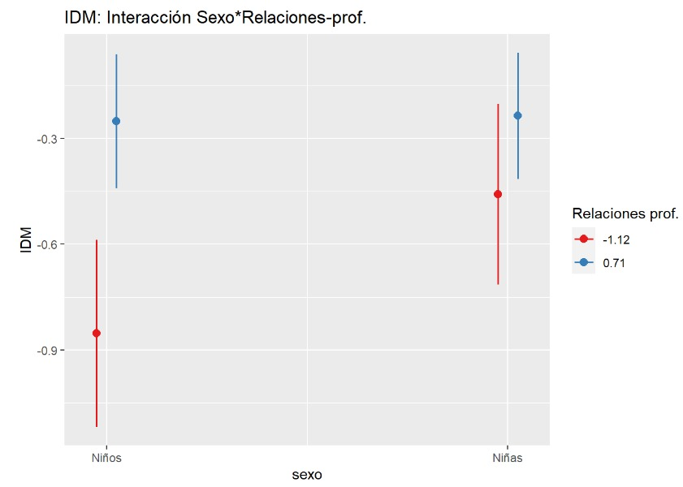]

???

En el gráfico podemos visualizar el efecto de interacción entre el sexo y las relaciones con los profesores para el caso de las actitudes hacia la igualdad de derechos para mujeres. Este es un efecto significativo y negativo.

Cabe precisar que en el gráfico se compara los dos casos extremos de las relaciones con los profesores. En rojo podemos ver las actitudes de los estudiantes pertenecientes a aulas con el puntaje más bajo de relaciones con los profesores, mientras que en azul se presentan las actitudes de quienes pertenecen a aulas con el puntaje más alto de relaciones con los profesores. 

Podemos ver que en el caso de los niños, que son quienes comparativamente tienen actitudes menos favorables a la igualdad de derechos, marca una gran diferencia en sus actitudes pertenecer o no a un aula donde hay buenas relaciones entre profesores y estudiantes. 

En términos sustantivos, estos resultados implican que el efecto negativo de pertenecer al sexo masculino en las actitudes del joven hacia la igualdad de derechos entre hombres y mujeres disminuye significativamente cuando hay buenas relaciones entre los profesores y los estudiantes.

---
# Igualdad de derechos grupos étnicos

.center[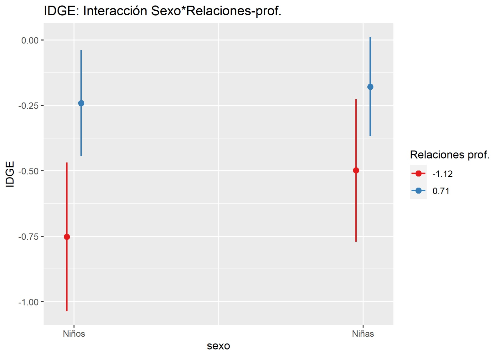]

???

En este gráfico podemos ver la interacción entre el sexo y las relaciones con los profesores para el caso de las actitudes hacia la igualdad de derechos para grupos étnicos. 

Como podemos ver, el panorama es bastante similar al que vimos en la lámina anterior. Los niños que pertenecen a aulas donde hay muy buenas relaciones con los profesores aumentan significativamente sus actitudes hacia la igualdad de derechos. De modo que, aulas con buenas relaciones entre estudiantes y profesores permiten disminuir la relevancia del sexo en las actitudes hacia la igualdad de derechos para grupos étnicos.

---
# Igualdad de derechos mujeres

.center[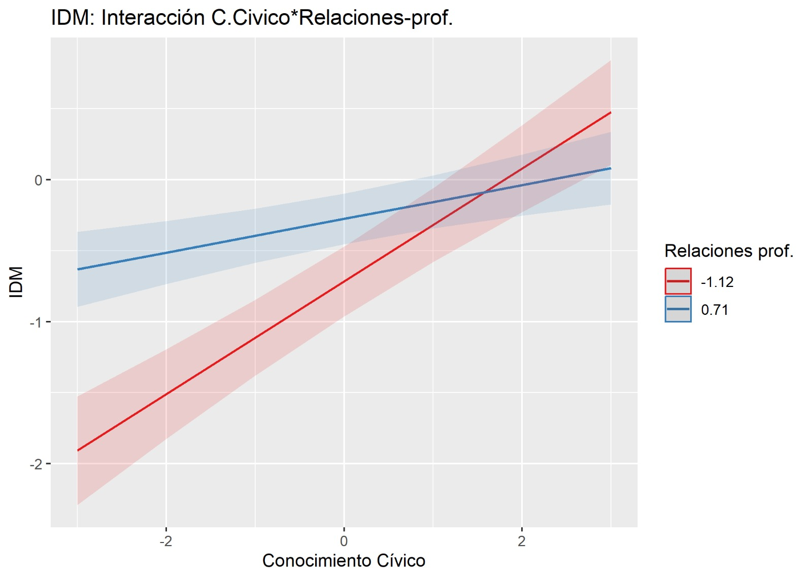]

???

En este gráfico podemos visualizar el efecto de interacción entre el conocimiento cívico del estudiante y las relaciones con los profesores en el aula para el caso de la igualdad de derechos para las mujeres. Como pueden ver, al comparar los casos extremos de buenas relaciones con el profesor, encontramos que incluso aquellos estudiantes que tienen un conocimiento cívico dos desviaciones estándar menor al promedio, cuando pertenecen a un aula con muy buenas relaciones con los profesores, alcanzan actitudes hacia la igualdad de derechos que son mucho más favorables que cuando este mismo tipo de estudiantes asiste a un aula donde hay malas relaciones con los profesores. 

En otras palabras, las buenas relaciones con los profesores permiten disminuir la relevancia del conocimiento cívico en las actitudes hacia la igualdad de derechos, permitiendo que aquellos estudiantes con escasos niveles de conocimiento cívico tengan actitudes más favorables a la igualdad de derechos entre hombres y mujeres.

---
# Igualdad de derechos grupos étnicos

.center[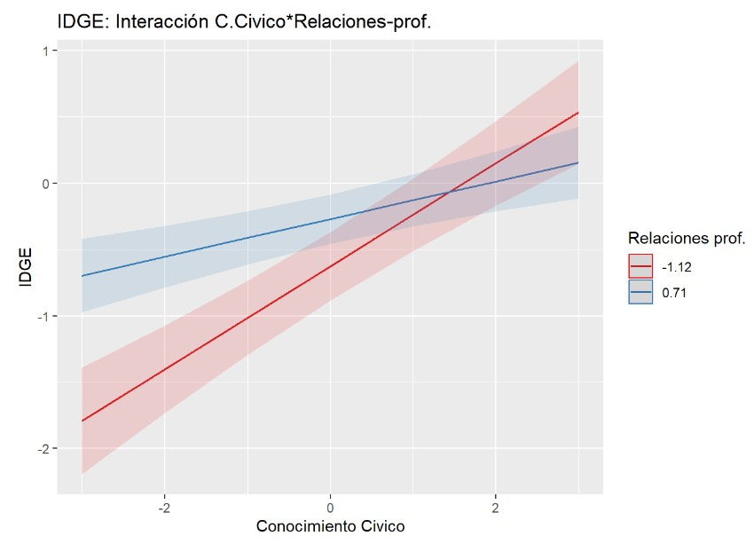]

???

Y bueno, en este último gráfico podemos ver un panorama casi idéntico al presentado en el gráfico anterior, lo que nos indica que las buenas relaciones con los profesores también permiten a los estudiantes con escasos niveles de conocimiento cívico tener actitudes más favorables hacia la igualdad de derechos para grupos étnicos, en comparación a sus pares con el mismo nivel de conocimiento cívico y que pertenecen a aulas donde no hay buenas relaciones con los profesores.
---
class: inverse, middle, center

# <strong><span style='color:#FFFFFF'> Conclusiones y discusión </span></strong>

---
# Conclusiones

* <p style="text-align: justify;"> El sexo y el conocimiento civico se asocian con las tres dimensiones.	</p>

* <p style="text-align: justify;"> Buenas relaciones con profesores se asocian positivamente con dos de las de las dimensiones.	</p>

* <p style="text-align: justify;"> Buenas relaciones con profesores moderan algunas diferencias en actitudes individuales.	</p>

???

En relación con la hipótesis de la posición de desventaja, es posible afirmar que pertenecer al sexo femenino se asocia positivamente con las actitudes hacia la igualdad de derechos en las tres dimensiones en estudio. Igualmente, el conocimiento cívico demostró tener un considerable efecto positivo sobre las actitudes hacia la igualdad de derechos.

En relación con las características de la escuela, se evidencia que las buenas relaciones interpersonales entre estudiantes y profesores mejoran las actitudes hacia la igualdad en dos dimensiones. Aunque de modo contrario a lo hipotetizado, las buenas relaciones entre estudiantes y la presencia de situaciones de violencia en el establecimiento no tienen efectos significativos en ninguna de las tres variables dependientes. 

Así como tampoco se logra generar evidencia a favor de la teoria del contacto intergrupal y del efecto compañeros respecto a las actitudes hacia la igualdad de derechos entre jovenes de edad escolar. En el caso de este estudio no se ha encontrado una asociación entre las características de composición del aula y las actitudes hacia la igualdad de derechos al considerar además otros factores influyentes.

A partir de la interacción multinivel se puede evidenciar que mejores relaciones con los profesores disminuyen las diferencias basadas tanto en el sexo como en el conocimiento cívico de los estudiantes en dos de las tres dimensiones analizadas. Más específicamente, las buenas relaciones con el profesor en el aula son capaces de moderar o disminuir las diferencias tanto en las actitudes hacia la igualdad de derechos entre hombres y mujeres como en las actitudes hacia la igualdad de derechos para grupos étnicos.

---

# Discusión

* <p style="text-align: justify;"> Se releva el rol de la socialización escolar más alla de lo curricular.	</p>

* <p style="text-align: justify;">Como política pública se releva la formación integral de profesores.	</p>

???

Estos resultados relevan el rol de la socialización escolar más allá de lo curricular, destacando la relevancia de las buenas relaciones con los profesores en la formación de ciudadanos comprometidos con la igualdad de derechos. 

Siguiendo la evidencia levantada por tanto por Caro y Schulz (2012), como por Schulz y Ainley (2018) se esperaba un relevante efecto del clima escolar en las actitudes hacia la igualdad de derechos. Basados en esta premisa, la presente investigación diferenció las relaciones con el profesor de las relaciones entre estudiantes, y al diferenciar los efectos del clima del aula en tres dimensiones se pudo observar que buena parte del efecto del clima del aula se debe en particular a la relación que poseen los estudiantes con los profesores.

En términos de política pública esto releva la importancia de fomentar una formación integral de los profesores, preparándolos no solo para enseñar sus respectivas asignaturas sino, también, para dotarlos con herramientas socioemocionales para mantener un buen trato y buenas relaciones con los estudiantes.

---

## Limitaciones y futuros estudios

* <p style="text-align: justify;"> Limitación: método de análisis.	</p>

* <p style="text-align: justify;"> Limitación: parsimonía del modelo.	</p>

* <p style="text-align: justify;"> Posible relación entre apertura a la discusión y relaciones con los profesores.	</p>

* <p style="text-align: justify;"> Profundizar en el estudio de IDH.	</p>

* <p style="text-align: justify;"> ¿Qué son las buenas relaciones?	</p>

???

Creo que una de las principales limitaciones del estudio corresponde al método de análisis utilizado. Originalmente se esperaba usar un modelo sem multinivel para variables ordinales ya que esta es una técnica estadística especialmente diseñada para trabajar con variables latentes, lo que disminuye el error de medida en las estimaciones. Lamentablemente este tipo de modelos solo esta disponible en software de pago y esta en desarrollo en software abiertos como R.

Asimismo, otra limitación relevante corresponde a la poca parsimonía del modelo. Utilizar tantos predictores puede aumentar las probablidades de encontrar relaciones significativa que en realidad se deban al azar.

En relación con posibles futuras investigaciones, me gustaría proponer en particular tres. 

En primer lugar,  llama la atención que la apertura a la discusión en el aula no haya presentado efectos significativos, lo cual se podría deber a que la apertura a la discusión tenga un efecto sobre las relaciones con los profesores, haciendose relevante indagar en esta posible relación de mediación.

En segundo lugar, considero fundamental profundizar en los factores asociados a las actitudes hacia la igualda de derechos para homosexuales, ya que pudimos ver que, si bien comparte ciertos predictores relevantes con las otras dos dimensiones, en la mayoría de los casos las variables independientes propuestas no se asocian significativamente a este tipo de actitudes. 

Por último, considero importante profundizar con distintos métodos de las ciencias sociales en cuales son las caracteristicas de estas buenas relaciones entre estudiantes y profesores que son capaces de moderar las diferencias en las actitudes hacia la igualdad de derechos.

---
### Bibliografía
<p style="text-align: justify;font-size:50%;">Barber, C., Torney-Purta, J. y Fennelly, K. (2010). <i> Adolescents' Attitudes toward Immigrants' Rights and Nationalism in 25 Countries. </i> Conference: 4th IEA International Research Conference (IRC-2010). At: Gothenburg, Sweden. </p> 
<p style="text-align: justify;font-size:50%;"> Bárcena, A., Prado, A., Abramo, L. & Pérez, R. (2016). <i> La matriz de la desigualdad social en América Latina. </i> Naciones Unidas, Comisión Económica para América Latina y el Caribe (CEPAL): Santiago. </p>
<p style="text-align: justify;font-size:50%;"> Caro, D. H., & Schulz, W. (2012). Ten Hypotheses about Tolerance toward Minorities among Latin American Adolescents. <i>Citizenship, Social and Economics Education, 11</i>(3), pp.213-234. doi:10.2304/csee.2012.11.3.213</p>
<p style="text-align: justify;font-size:50%;"> Conde, F. (2014). Desigualdad, discriminación y pedagogía de la igualdad. <i> Revista Actividades Investigativas en Educación, Universidad de Costa Rica, </i>(14), pp.1-20. </p>
<p style="text-align: justify;font-size:50%;"> Isac, M. M., Maslowski, R., & Van der Werf, G. (2012). Native student attitudes towards equal rights for immigrants. A study in 18 European countries. <i> Journal of Social Science Education, 11</i>(1), pp. 7-26, https://doi.org/10.2390/jsse-v11-i1-1189 </p>
<p style="text-align: justify;font-size:50%;"> Ministerio de Educación (Mineduc). (2016). Orientaciones para la elaboración del plan de Formación Ciudadana. Revisado en https://formacionciudadana.mineduc.cl/wp-content/uploads/sites/46/
2016/04/DEG-OrientacionesPFC-intervenible-AReader_FINAL.pdf </p>
<p style="text-align: justify;font-size:50%;"> Miranda, D., Castillo, J., & Cumsille, P. (2018). The Political Socialization of Attitudes Toward Equal Rights from a Comparative Perspective. En Sandoval-Hernández, A., Isac, M., & Miranda, D. (Eds.). <i> Teaching Tolerance in a Globalized World </i> (pp. 103-124). International Association for the Evaluation of Educational Achievement (IEA). </p>
<p style="text-align: justify;font-size:50%;"> PNUD (2017). <i>  Desiguales. Orígenes, cambios y desafíos de la brecha social en Chile. </i> Programa de las Naciones Unidas para el Desarrollo: Santiago. </p>
<p style="text-align: justify;font-size:50%;"> Schlozman, K., Verba, S. & Brady, H. (2012). The Unheavenly Chorus: Unequal Political Voice and the Broken Promise of American Democracy. The Unheavenly Chorus: Unequal Political Voice and the Broken Promise of American Democracy. 10.1515/9781400841912. </p>
<p style="text-align: justify;font-size:50%;"> Schulz, W. & Ainley, J. (2018). <i> Students’ attitudes toward equality opportunities, trust in civic institutions and endorsement of religious influence.</i> The Australian Council for Educational Research (ACER). Revisado en https://iccs.acer.org/files/SchulzAinley_CivicAttitudes%28AERA2018%29.pdf </p> 
<p style="text-align: justify;font-size:50%;"> Schulz, W., Ainley, J., Friedman, T. & Lietz, P. (2011). <i> Actitudes y conocimientos cívicos de estudiantes de secundaria en seis países de América Latina.</i> International Association for the Evaluation of Educational Achievement (IEA). </p> 
<p style="text-align: justify;font-size:50%;"> Schulz, W., Ainley, J., Cox, C. & Friedman, T. (2016). <i> Percepciones de los jóvenes acerca del gobierno, la convivencia pacífica y la diversidad en cinco países de América Latina.</i> International Association for the Evaluation of Educational Achievement (IEA). </p> 
<p style="text-align: justify;font-size:50%;"> Schulz, W., Ainley, J., Fraillon, J., Losito, B., & Agrusti, G. (2016). IEA International Civic and Citizenship Education Study 2016 Assessment Framework. International Association for the Evaluation of Educational Achievement (IEA). </p>
<p style="text-align: justify;font-size:50%;"> UNESCO (s.f.). <i> Declaración de Principios sobre la Tolerancia y Plan de Acción de Seguimiento del Año de las Naciones Unidas para la Tolerancia </i> Revisado en https://dialnet.unirioja.es/descarga/articulo/5072998.pdf </p>

---
class: inverse, middle, center
# <strong><span style='color:#FFFFFF'>¡Muchas gracias por su atención!</span></strong>
<br>
<br>
Esta presentación fue elaborada con Xaringan. <br> Mis agradecimientos a [Yihui Xie](https://yihui.org/).
<br>
<br>
.center[]

---

.center[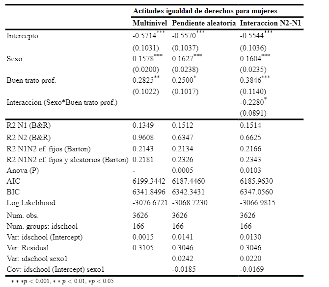]

---

.center[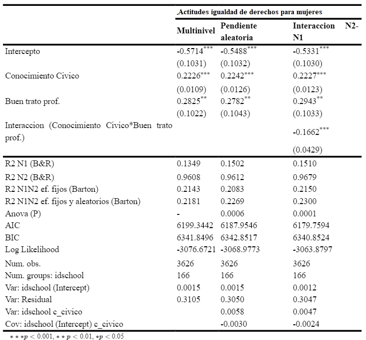]

---

.center[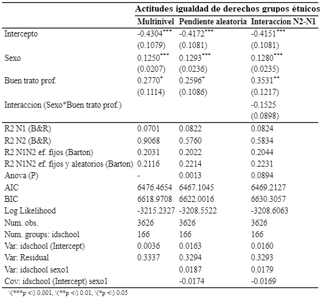]

---

.center[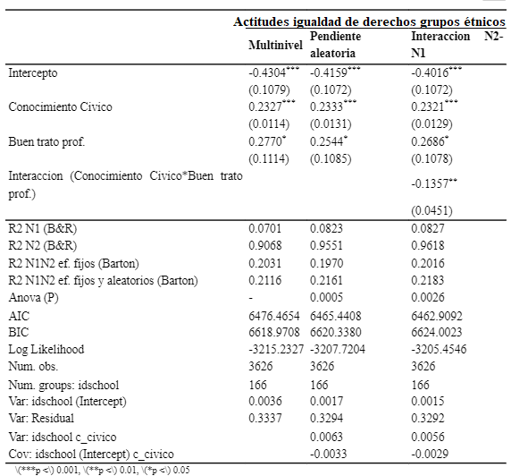]
